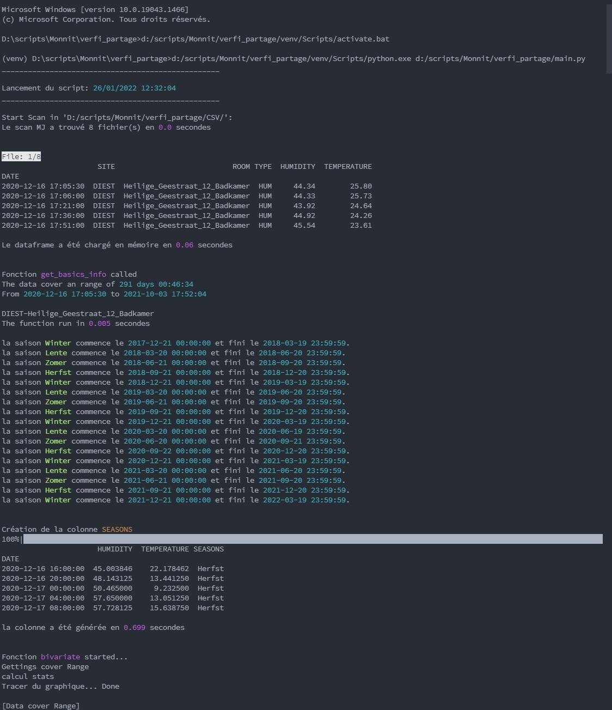
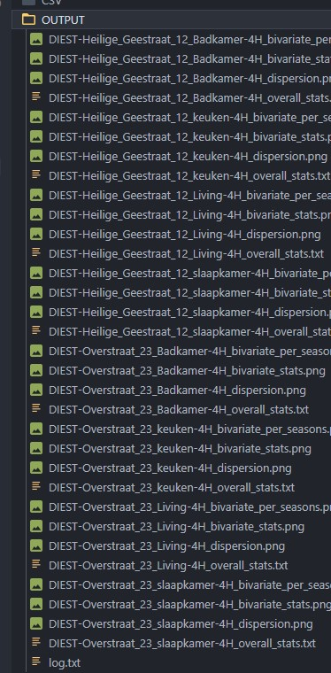

# Script WorkingWithMonnit: Génération d'un nuage de point bi-variate & coloration des saisons

- Version: Python 3.10.0 64bit
- Ressources additionnel: export_jupiter_notebook.html

## Installation environnement de travail et exécution du script
Création de l'environnement
```
python -m venv venv
```

Installation des dépendances utilisées 
```
pip install -r requirement.txt
```

Activation de l'environnement
```
/Scripts/activate.bat
```

exécution du script

```
python main.py
```

## Preview de l'éxécution dans la console



## Résultat du script


